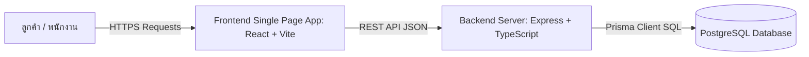
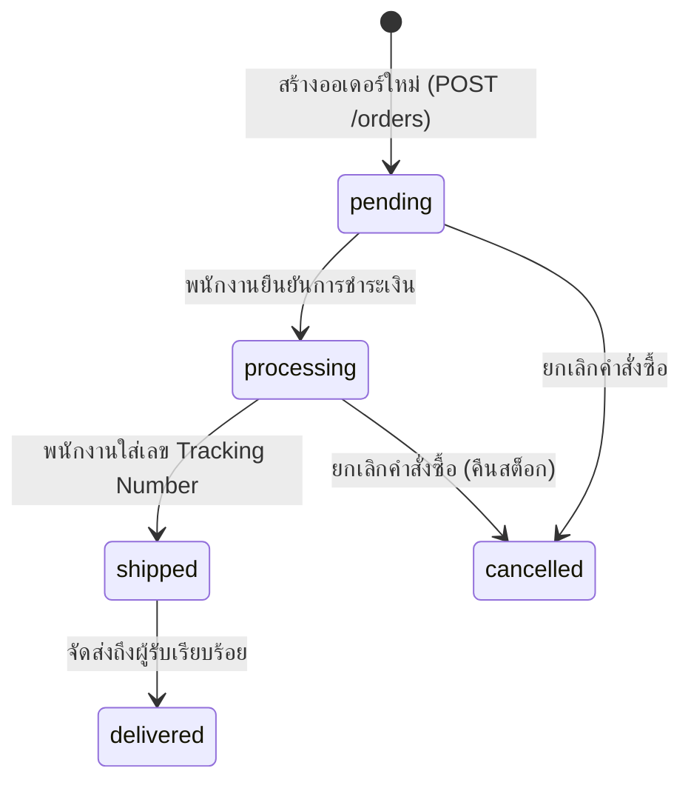

# เอกสารข้อกำหนดความต้องการซอฟต์แวร์ (Software Requirements Specification - SRS)
## โปรเจกต์: HyperGarage E-Commerce Platform
**มาตรฐานอ้างอิง: IEEE Std 830-1998 Standard for Software Requirements Specifications**

---

## 1. บทนำ (Introduction)

### 1.1 วัตถุประสงค์ (Purpose)
เอกสาร SRS ฉบับนี้จัดทำขึ้นเพื่อระบุข้อกำหนดทางฟังก์ชันการทำงาน (Functional Requirements) ข้อกำหนดที่ไม่ใช่เชิงฟังก์ชัน (Non-Functional Requirements) สถาปัตยกรรมระบบ และข้อกำหนดด้านความปลอดภัยของระบบ **HyperGarage E-Commerce Platform** ซึ่งเป็นระบบร้านค้าออนไลน์สำหรับอะไหล่และอุปกรณ์ตกแต่งรถยนต์แบบครบวงจร เอกสารนี้ใช้เป็นมาตรฐานกลางระหว่างทีมพัฒนา ผู้ดูแลระบบ และคณะกรรมการประเมินโครงงาน

### 1.2 ขอบเขตของระบบ (Scope of System)
**HyperGarage** เป็นเว็บแอปพลิเคชันรูปแบบ Decoupled Architecture ประกอบด้วย:
- **ระบบหน้าร้านสำหรับลูกค้า (Customer Storefront):** การค้นหาสินค้า, การกรองตามรุ่นรถยนต์ (Vehicle Compatibility Filter), ตะกร้าสินค้า, ระบบชำระเงิน, การสั่งซื้อสินค้าแบบสมาชิกและผู้ใช้ทั่วไป (Guest Checkout), การติดตามสถานะคำสั่งซื้อ, การขอคืนสินค้า และการรีวิวสินค้า
- **ระบบหลังบ้านสำหรับผู้ดูแลระบบ (Admin Management Dashboard):** การจัดการสินค้าและสต็อกแบบ Real-time, การกำหนดโปรโมชัน Flash Sale พร้อมระบบนับถอยหลัง, การอนุมัติคำขอคืนสินค้าและคืนสต็อกอัตโนมัติ, การจัดการสิทธิ์พนักงาน (RBAC), สถิติมุมมองผู้บริหาร และการสำรองข้อมูล (Backup)

### 1.3 คำศัพท์และคำย่อ (Definitions, Acronyms, and Abbreviations)
- **SRS:** Software Requirements Specification
- **RBAC:** Role-Based Access Control (การควบคุมการเข้าถึงตามบทบาท)
- **JWT:** JSON Web Token (โทเคนยืนยันตัวตนแบบดิจิทัล)
- **ORM:** Object-Relational Mapping (Prisma)
- **PII:** Personally Identifiable Information (ข้อมูลระบุตัวตนบุคคล)
- **ACID:** Atomicity, Consistency, Isolation, Durability (คุณสมบัติของ Database Transaction)

---

## 2. ภาพรวมของระบบ (Overall Description)

### 2.1 มุมมองของผลิตภัณฑ์ (Product Perspective)
ระบบถูกออกแบบตามสถาปัตยกรรม **Client-Server Architecture**:

### 2.2 กลุ่มผู้ใช้งานและคุณลักษณะ (User Classes and Characteristics)
1. **ลูกค้าทั่วไป / ผู้เยี่ยมชม (Guest / Customer):** ใช้งานสั่งซื้อสินค้า, ค้นหาอะไหล่ตรงรุ่นรถ, ติดตามออเดอร์ด้วยเบอร์โทรศัพท์
2. **พนักงานคลังสินค้า (Stock Staff):** จัดการข้อมูลสินค้า, หมวดหมู่, แบรนด์, ปรับสต็อก และตั้งค่าโปรโมชัน Flash Sale
3. **พนักงานจัดการคำสั่งซื้อ (Order Staff):** ตรวจสอบออเดอร์, อัปเดตสถานะการจัดส่ง, และดำเนินการคำขอคืนสินค้า
4. **ผู้ดูแลระบบสูงสุด (Super Admin):** จัดการสิทธิ์พนักงาน, ดูรายงานสถิติมุมมองผู้บริหาร, และดาวน์โหลดไฟล์ Backup

### 2.3 ข้อจำกัดในการออกแบบและการพัฒนา (Design and Implementation Constraints)
- **Language & Framework:** Node.js (TypeScript), React 18, Vite
- **Database System:** PostgreSQL 15+ ผ่าน Prisma ORM
- **Security Constraint:** ต้องไม่มีการเก็บ Hardcoded Password หรือ Secret Keys ในซอร์สโค้ด (ใช้ Environment Variables ทั้งหมด)

---

## 3. ข้อกำหนดความต้องการเฉพาะ (Specific Requirements)

### 3.1 ข้อกำหนดเชิงฟังก์ชัน (Functional Requirements - FR)

#### [FR-01] ระบบจัดการตะกร้าสินค้าและการสั่งซื้อ (Checkout & Order Management)
- **FR-01.1:** ระบบต้องคำนวณราคาสินค้าและราคารวมจากฐานข้อมูลฝั่ง Server เท่านั้น ห้ามใช้น้ำหนักราคาจาก Client
- **FR-01.2:** ระบบต้องตรวจสอบจำนวนสต็อกที่มีอยู่จริง หากสต็อกไม่พอต้องปฏิเสธคำขอทันที
- **FR-01.3:** การตัดสต็อกและการบันทึกออเดอร์ต้องทำผ่าน **Database Transaction** หากขั้นตอนใดล้มเหลวต้อง Rollback ข้อมูลทั้งหมด

#### [FR-02] ระบบโปรโมชันและนับถอยหลัง Flash Sale (Flash Sale & Countdown Engine)
- **FR-02.1:** ผู้ดูแลระบบสามารถกำหนดส่วนลด (%) และวันเวลาสิ้นสุด (`flashSaleEnd`) ของสินค้าแต่ละชิ้นได้
- **FR-02.2:** หน้าแรกของระบบต้องแสดงตัวนับถอยหลัง (D/H/M/S) ไปยังวันสิ้นสุดของสินค้า Flash Sale ที่เร็วที่สุดในอนาคต
- **FR-02.3:** หากวันสิ้นสุดหมดอายุแล้ว ระบบต้องแสดง `00 00 00 00` (หมดเวลา) โดยไม่เด้งไปใช้เวลาสำรอง

#### [FR-03] ระบบยืนยันตัวตนและการควบคุมสิทธิ์ (Authentication & RBAC)
- **FR-03.1:** การเข้าสู่ระบบพนักงานต้องตรวจสอบรหัสผ่านที่แฮชด้วย Bcrypt (Salt Rounds = 10)
- **FR-03.2:** ระบบต้องออก JWT Token สำหรับยืนยันตัวตนในคำขอถัดไป
- **FR-03.3:** `authMiddleware` ต้องทำการคิวรีเช็กตัวตนพนักงานกับฐานข้อมูล PostgreSQL ทุกคำขอ เพื่อรองรับการยกเลิกสิทธิ์ทันที (Revocation)

#### [FR-04] ระบบการคืนสินค้าและการคืนสต็อกอัตโนมัติ (Returns & Automated Restocking)
- **FR-04.1:** ผู้ใช้ต้องระบุข้อมูลยืนยันความเป็นเจ้าของคำสั่งซื้อ (เบอร์โทรศัพท์ หรือ Token บัญชี) ก่อนยื่นคำขอคืนสินค้า
- **FR-04.2:** เมื่อพนักงานอนุมัติคำขอคืนสินค้า ระบบต้องทำการวนลูปคืนสต็อกสินค้า (`increment stock`) เข้าฐานข้อมูลโดยอัตโนมัติผ่าน Transaction

#### [FR-05] ระบบประเมินและรีวิวสินค้า (Review & Rating System)
- **FR-05.1:** รองรับการให้คะแนนดาว 1-5 ดาว ข้อความคอมเมนต์ และการอัปโหลดรูปภาพประกอบ
- **FR-05.2:** เมื่อมีการสร้างรีวิวใหม่ ระบบต้องคำนวณคะแนนดาวเฉลี่ย (`_avg.rating`) และจำนวนรีวิวรวม (`_count`) อัปเดตกลับไปยังตารางสินค้าหลักทันที

---

### 3.2 ข้อกำหนดที่ไม่ใช่เชิงฟังก์ชัน (Non-Functional Requirements - NFR)

#### [NFR-01] ด้านความปลอดภัย (Security Requirements)
- **NFR-01.1 (Injection Prevention):** ระบบต้องป้องกัน SQL Injection 100% โดยการใช้ Prisma Prepared Statements
- **NFR-01.2 (PII Protection):** ปิดการเข้าถึงข้อมูลคำสั่งซื้อและข้อมูลส่วนบุคคลของผู้ใช้รายอื่น หากไม่ระบุทั้ง `phone` และ `orderNumber`
- **NFR-01.3 (Secret Management):** บังคับใช้ระบบสุ่ม Runtime JWT Secret ในโหมด Development และระบุผ่าน Environment Variables ในโหมด Production

#### [NFR-02] ด้านประสิทธิภาพและการตอบสนอง (Performance & Responsiveness)
- **NFR-02.1:** หน้าเว็บต้องรองรับการโหลดข้อมูลผ่าน TanStack React Query Caching เพื่อลดปริมาณคำขอ HTTP ซ้ำซ้อน
- **NFR-02.2:** ระบบต้องทำการ Invalidate Cache อัตโนมัติเมื่อเกิด Mutation เพื่อให้ข้อมูลบนหน้าจอเป็นปัจจุบันโดยไม่ต้องรีเฟรช

#### [NFR-03] ด้านความถูกต้องของโซนเวลา (Timezone Accuracy)
- **NFR-03.1:** ระบบต้องจัดเก็บเวลาในฐานข้อมูลเป็นมาตรฐาน ISO 8601 UTC
- **NFR-03.2:** ระบบฝั่ง Frontend ต้องแปลงเวลา UTC เป็น Local Timezone (+7) ในการแสดงผลและการตั้งค่าผ่าน DatePicker

---

## 4. พจนานุกรมข้อมูลและผังสถานะ (Data Dictionary & State Diagrams)

### 4.1 ผังการเปลี่ยนสถานะคำสั่งซื้อ (Order State Transition Diagram)

---

## 5. เกณฑ์การตรวจรับและทดสอบระบบ (Verification & Validation Criteria)

| รหัสทดสอบ | กรณีการทดสอบ (Test Case) | ผลลัพธ์ที่คาดหวัง (Expected Result) | สถานะการตรวจสอบ |
| :--- | :--- | :--- | :--- |
| **TC-01** | ทดสอบสั่งซื้อสินค้าที่สต็อกเหลือ 0 | ระบบปฏิเสธคำขอขึ้นข้อความ "Stock not enough" | **PASSED** |
| **TC-02** | ทดสอบดึงรายการออเดอร์โดยไม่ระบุเบอร์โทร | ระบบตอบกลับ `403 Forbidden` / บล็อกการดึงข้อมูลส่วนบุคคล | **PASSED** |
| **TC-03** | ทดสอบอนุมัติการคืนสินค้า | สต็อกสินค้าในตาราง Product/Variant เพิ่มขึ้นตามจำนวนออเดอร์อัตโนมัติ | **PASSED** |
| **TC-04** | ทดสอบตั้งค่าเวลา Flash Sale ใน Admin | แสดง Popup Calendar ธีมมืด และส่งเวลาเป็น UTC ISO เข้า DB | **PASSED** |
| **TC-05** | ทดสอบรัน Static Security Analysis (`oxlint`) | ไม่พบข้อผิดพลาด (`Found 0 warnings and 0 errors`) | **PASSED** |
