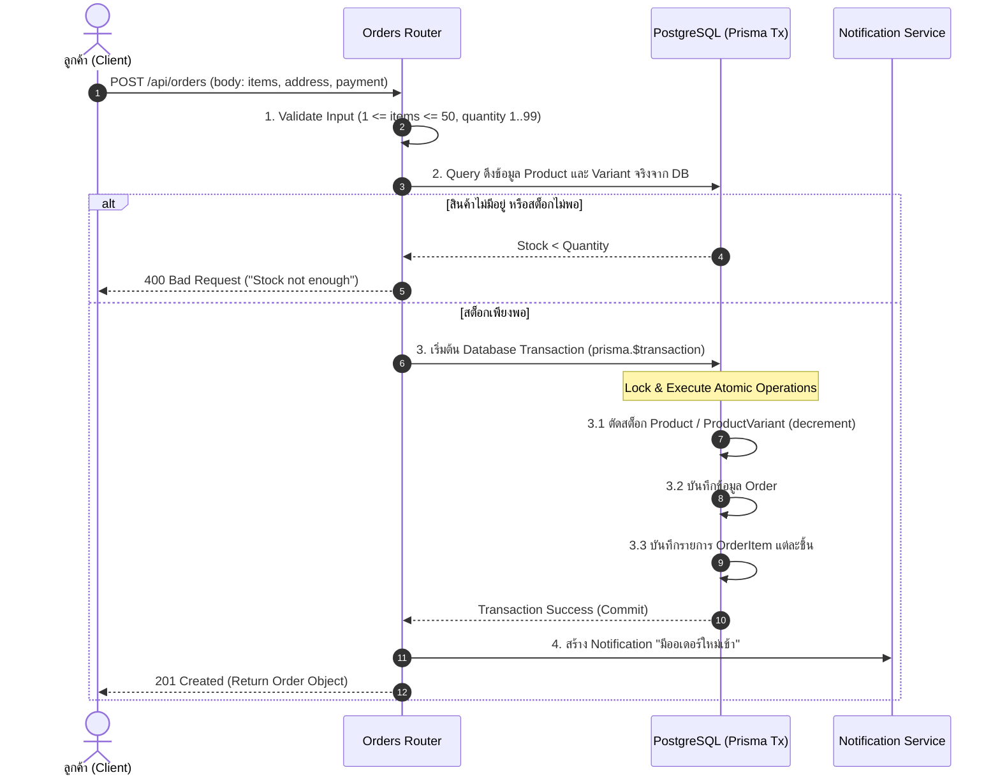
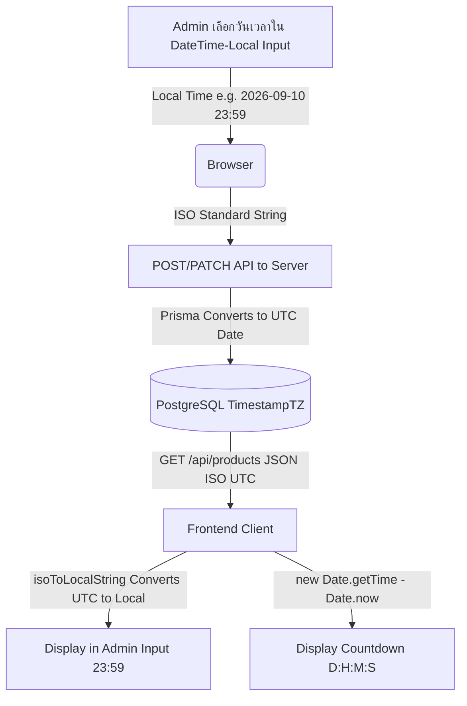
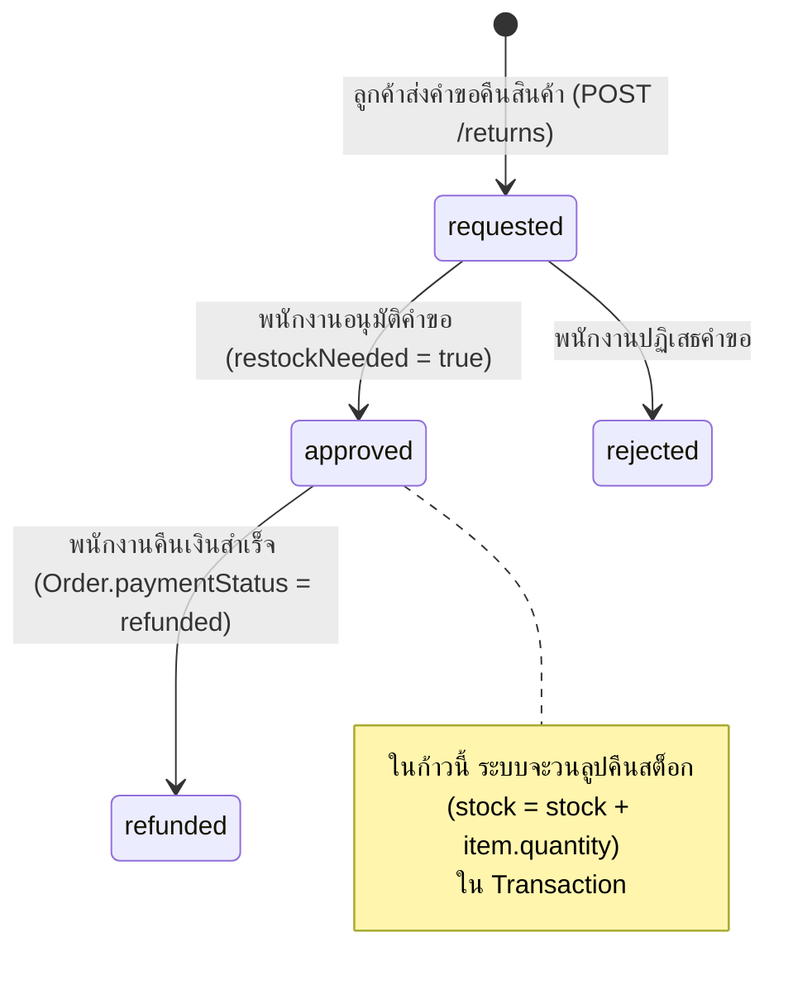
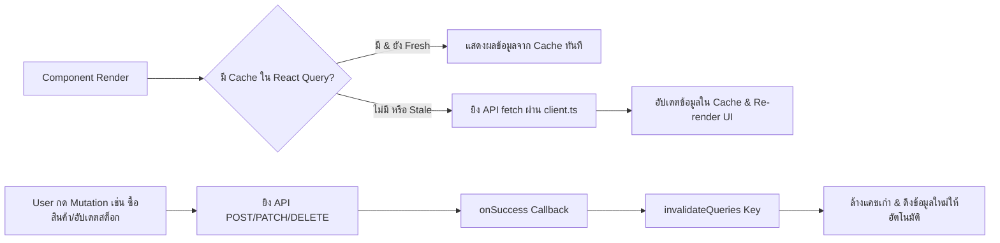

# เอกสารเจาะลึก Logic การทำงานและขั้นตอนระบบ (HyperGarage Deep-Dive Technical Logic)

เอกสารฉบับนี้จัดทำขึ้นสำหรับการไล่อ่านทำความเข้าใจ **Logic การทำงานเชิงลึก (Business Logic, Flowcharts, State Transitions, และ Edge Cases)** ของทั้งฝั่ง Backend และ Frontend ในโปรเจกต์ **HyperGarage** เพื่อให้สามารถอธิบายการทำงานได้ทุกบรรทัด

---

## 1. ผังโครงสร้างข้อมูลและรูปแบบความสัมพันธ์ (Database Model & Schema Logic)

ฐานข้อมูลของ HyperGarage ออกแบบบน **Prisma ORM + PostgreSQL** มีความสัมพันธ์ (Relationships) หลักดังนี้:

```mermaid
erDiagram
    STAFF ||--o{ AUDIT_LOG : "creates"
    CUSTOMER ||--o{ CUSTOMER_ADDRESS : "has"
    CUSTOMER ||--o{ ORDER : "places"
    PRODUCT ||--o{ PRODUCT_VARIANT : "has"
    PRODUCT ||--o{ PRODUCT_COMPATIBILITY : "supports"
    PRODUCT ||--o{ REVIEW : "receives"
    CATEGORY ||--o{ PRODUCT : "contains"
    BRAND ||--o{ PRODUCT : "manufactures"
    ORDER ||--o{ ORDER_ITEM : "contains"
    ORDER ||--o! RETURN : "has"

    PRODUCT {
        string id PK
        string name
        float price
        float discount
        boolean isFlashSale
        datetime flashSaleEnd
        int stock
        float rating
    }

    PRODUCT_VARIANT {
        string id PK
        string productId FK
        string name
        float priceDelta
        int stock
    }

    ORDER {
        string id PK
        string orderNumber
        string customerId FK
        float total
        string status
        string paymentStatus
    }

    RETURN {
        string id PK
        string orderId FK
        string status
        float refundAmount
    }
```

---

## 2. เจาะลึก Logic ฝั่ง Backend (Backend Business Logic)

### 2.1 Logic การสั่งซื้อสินค้าและการตัดสต็อก (Checkout Logic: `POST /api/orders`)

ไฟล์: **[server/src/routes/orders.ts](file:///Users/pn/Desktop/Fouxth/HyperGarage/server/src/routes/orders.ts)**

#### ขั้นตอนการทำงาน (Step-by-Step Flow):



#### Logic สำคัญในโค้ด:
1. **Security & Price Safety:** ราคาของสินค้าไม่ได้ใช้ราคาที่ส่งมาจาก Client (ป้องกัน Client แก้ไขราคาใน F12) แต่เซิร์ฟเวอร์จะ Query หา `price` และ `priceDelta` จาก DB จริงมาคำนวณ `total` ใหม่เองในเซิร์ฟเวอร์
2. **ACID Transaction:** ใช้ `prisma.$transaction` เพื่อการันตีว่า **การตัดสต็อกสินค้าทุกชิ้นและการสร้างออเดอร์ ต้องสำเร็จพร้อมกันทั้งหมด** หากชิ้นใดชิ้นหนึ่งล้มเหลว คำสั่งซื้อทั้งหมดจะถูก Rollback ยกเลิกทันที

---

### 2.2 Logic ระบบ Flash Sale และการจัดการโซนเวลา (Flash Sale & Timezone Logic)

ไฟล์: **[server/src/routes/products.ts](file:///Users/pn/Desktop/Fouxth/HyperGarage/server/src/routes/products.ts)** & **[FlashSalePage.tsx](file:///Users/pn/Desktop/Fouxth/HyperGarage/src/pages/admin/FlashSalePage.tsx)**

#### ลำดับการแปลงโซนเวลา (Timezone Lifecycle):



#### Logic การคำนวณวันสิ้นสุดนับถอยหลังหน้าแรก ([HomePage.tsx](file:///Users/pn/Desktop/Fouxth/HyperGarage/src/pages/customer/HomePage.tsx)):
```typescript
const target = useMemo(() => {
  // 1. ดึงวันสิ้นสุดของสินค้า Flash Sale ทั้งหมด
  const dates = flashProducts
    .map((p) => (p.flashSaleEnd ? new Date(p.flashSaleEnd).getTime() : 0))
    .filter((t) => !isNaN(t) && t > 0)

  if (dates.length > 0) {
    // 2. คัดเลือกเฉพาะวันที่ในอนาคตที่ยังไม่หมดเวลา (t > Date.now())
    const futureDates = dates.filter((t) => t > Date.now())
    if (futureDates.length > 0) {
      // คืนค่าวันที่ที่หมดอายุเร็วที่สุดในอนาคต
      return new Date(Math.min(...futureDates))
    }
    // 3. หากทุกสินค้าหมดอายุไปแล้ว คืนค่าวันที่ล่าสุดในอดีต (ทำให้ diff <= 0 -> แสดง 00:00:00:00)
    return new Date(Math.max(...dates))
  }

  // 4. กรณีไม่มีการตั้ง flashSaleEnd ให้ใช้ Fallback สำรอง +3 วัน
  const d = new Date()
  d.setDate(d.getDate() + 3)
  d.setHours(23, 59, 59, 0)
  return d
}, [flashProducts])
```

---

### 2.3 Logic การคืนสินค้าและการคืนสต็อกอัตโนมัติ (Return & Restock Logic: `PATCH /api/returns/:id/status`)

ไฟล์: **[server/src/routes/returns.ts](file:///Users/pn/Desktop/Fouxth/HyperGarage/server/src/routes/returns.ts)**

#### สถานะการคืนสินค้า (Return Status Transitions):



#### Code Logic การวนลูปคืนสต็อก:
```typescript
const restockNeeded = (status === 'approved' || status === 'refunded') && existing.status === 'requested'

const updated = await prisma.$transaction(async (tx) => {
  if (restockNeeded) {
    for (const item of existing.order.items) {
      if (item.variantId) {
        // หากมี Variant ให้เพิ่มสต็อกกลับใน ProductVariant
        await tx.productVariant.update({ where: { id: item.variantId }, data: { stock: { increment: item.quantity } } })
      } else {
        // หากไม่มี Variant ให้เพิ่มสต็อกกลับใน Product หลัก
        await tx.product.update({ where: { id: item.productId }, data: { stock: { increment: item.quantity } } })
      }
    }
  }
  // อัปเดตสถานะการคืนเงินและคำขอคืนสินค้า
  return tx.return.update({ where: { id }, data: { status, refundAmount, note } })
})
```

---

### 2.4 Logic การคำนวณคะแนนรีวิวเฉลี่ย (Review Aggregation: `POST /api/reviews`)

ไฟล์: **[server/src/routes/reviews.ts](file:///Users/pn/Desktop/Fouxth/HyperGarage/server/src/routes/reviews.ts)**

เมื่อมีรีวิวใหม่ส่งเข้ามา เซิร์ฟเวอร์ไม่ได้แค่อ่าน/เขียนข้อมูลรีวิวลงตาราง แต่ใช้ **Prisma Aggregate** ในการอัปเดตคะแนนรวมของสินค้าทันที:

```typescript
const review = await prisma.$transaction(async (tx) => {
  // 1. สร้างตาราง Review ใหม่
  const created = await tx.review.create({ data: { productId, userName, rating, comment, images } })
  
  // 2. คำนวณหาคะแนนเฉลี่ยดาว (_avg) และจำนวนรีวิวรวม (_count) ของสินค้านี้
  const agg = await tx.review.aggregate({
    where: { productId },
    _avg: { rating: true },
    _count: true,
  })
  
  // 3. สะท้อนคะแนนกลับไปที่ตาราง Product
  await tx.product.update({
    where: { id: productId },
    data: { rating: agg._avg.rating ?? 0, reviewCount: agg._count },
  })
  return created
})
```

---

### 2.5 Logic การตรวจสอบยืนยันตัวตน และสิทธิ์การใช้งาน (Authentication & Security Logic)

ไฟล์: **[authMiddleware.ts](file:///Users/pn/Desktop/Fouxth/HyperGarage/server/src/middlewares/authMiddleware.ts)**

#### ขั้นตอนการทำงานของ Middleware:
1. **Extract Header:** อ่านค่า `req.headers.authorization` รูปแบบ `Bearer <token>`
2. **Verify Secret:** ใช้ `getJwtSecret()` ถอดรหัสผ่าน `jwt.verify(token, secret)`
3. **Database Re-Verification (สำคัญมาก):**
   ```typescript
   const staff = await prisma.staff.findUnique({
     where: { id: decoded.id },
     select: { id: true, email: true, name: true, role: true },
   })
   if (!staff) {
     return res.status(401).json({ error: 'Account no longer exists or access revoked' })
   }
   ```
   **เหตุผลเชิงเทคนิค:** JWT เป็น Stateless แต่การสั่ง query เช็กฐานข้อมูลอีกรอบ การันตีว่าหาก SuperAdmin ทำการลบพนักงาน หรือเปลี่ยนบทบาท (Role) ของพนักงาน พนักงานคนนั้นจะถูกตัดสิทธิ์ทันทีในคำขอถัดไป (Token เก่าที่ยังไม่หมดอายุจะใช้ไม่ได้อีกต่อไป)

---

## 3. เจาะลึก Logic ฝั่ง Frontend (Frontend Architecture & Logic)

### 3.1 สถาปัตยกรรม React Query Data Lifecycle

ไฟล์: **[src/api/hooks.ts](file:///Users/pn/Desktop/Fouxth/HyperGarage/src/api/hooks.ts)**



#### ตัวอย่าง Code Pattern ของ React Query Invalidation:
```typescript
export const useCheckout = () => {
  const queryClient = useQueryClient()
  return useMutation({
    mutationFn: (input: CheckoutInput) => api.checkout(input),
    onSuccess: () => {
      // เมื่อสั่งซื้อสำเร็จ สั่งให้ดึงข้อมูลออเดอร์, สินค้า (สต็อกลดลง), และสถิติแดชบอร์ดใหม่พร้อมกัน
      queryClient.invalidateQueries({ queryKey: ['orders'] })
      queryClient.invalidateQueries({ queryKey: ['products'] })
      queryClient.invalidateQueries({ queryKey: ['dashboardStats'] })
    },
  })
}
```

---

### 3.2 Logic ตะกร้าสินค้าและการบันทึกข้ามเซสชัน ([CartContext.tsx](file:///Users/pn/Desktop/Fouxth/HyperGarage/src/context/CartContext.tsx))

- **State Syncing:** ข้อมูลรายการในตะกร้าสินค้าถูกจัดเก็บใน React State และซิงก์ลง `localStorage` ผ่าน `useEffect` ทุกครั้งที่มีการเปลี่ยนแปลง (`addItem`, `removeItem`, `updateQuantity`, `clearCart`)
- **Variant Matching:** การเช็กว่าสินค้าในตะกร้าเป็นชิ้นเดียวกันหรือไม่ จะเช็กจากทั้ง `productId` และ `variantId`:
  ```typescript
  const existingIndex = currentItems.findIndex(
    (item) => item.product.id === product.id && item.variant?.id === variant?.id
  )
  ```

---

## 4. สรุปจุดเด่นและคำศัพท์เชิงเทคนิคสำหรับใช้ตอบการพรีเซนต์

1. **Atomic Transactions (ACID Properties):** การใช้ `prisma.$transaction` ควบคุมความถูกต้องของการตัดสต็อกและการบันทึกออเดอร์
2. **Role-Based Access Control (RBAC):** การแบ่งระดับสิทธิ์พนักงาน (`SUPERADMIN`, `STOCK_STAFF`, `ORDER_STAFF`)
3. **Stateless JWT with Database Re-verification:** การใช้ JWT ร่วมกับการเช็กความมีตัวตนจริงใน DB เพื่อลบสิทธิ์พนักงานได้ทันที (Revocation)
4. **Data Query Caching & Invalidation:** การใช้ TanStack React Query บริหารจัดการข้อมูลแบบ asynchronous ให้หน้าเว็บตอบสนองรวดเร็วโดยไม่ต้องรีเฟรชหน้าเว็บ
5. **Timezone Standardization:** การเก็บเวลาใน DB เป็น UTC Standard และแปลงเป็น Local Timezone (+7) ใน UI ด้วย `isoToLocalString` และ `showPicker()`
