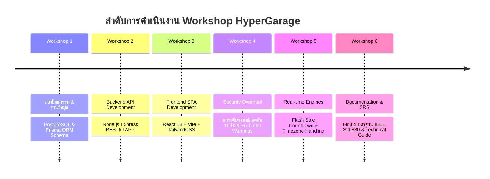

# รายงานสรุปการทำ Workshop และการพัฒนาระบบ (Project Workshops & Milestones Log)

เอกสารฉบับนี้รวบรวม **รายการ Workshop, กิจกรรมปฏิบัติการ, และบันทึกการพัฒนาโปรเจกต์ HyperGarage** ตั้งแต่เริ่มต้นจนถึงเวอร์ชันสมบูรณ์ เพื่อใช้เป็นหลักฐานประกอบการตรวจรับงานและรายงานผลความก้าวหน้าแก่คณะกรรมการประเมิน

---

## 📋 สรุปรายการ Workshop ทั้งหมด (Workshop Summary)

---

## 🛠️ รายละเอียดกิจกรรมและผลลัพธ์ในแต่ละ Workshop

### 1. Workshop 1: สถาปัตยกรรมระบบและออกแบบฐานข้อมูล (Database Architecture & Prisma ORM)
- **วัตถุประสงค์:** ออกแบบโครงสร้างฐานข้อมูลเชิงสัมพันธ์ (Relational Data Model) ที่รองรับความเข้ากันได้ของอะไหล่รถยนต์
- **ผลการดำเนินงาน:**
  - กำหนด Prisma Schema ครอบคลุม 12 ตารางข้อมูลหลัก (`Staff`, `Customer`, `Product`, `ProductVariant`, `ProductCompatibility`, `Order`, `OrderItem`, `Return`, `Review`, `Coupon`, `StoreSettings`, `AuditLog`)
  - สร้างไฟล์ Seed Data ตั้งต้น (`server/prisma/seed-data.ts`) สำหรับหมวดหมู่สินค้า แบรนด์ และรุ่นรถยนต์
  - เชื่อมต่อกับคลาวด์ฐานข้อมูล **PostgreSQL** และทำ Database Migrations

---

### 2. Workshop 2: พัฒนาระบบแบ็กเอนด์เอพีไอ (Backend RESTful API Development)
- **วัตถุประสงค์:** พัฒนาระบบ API ฝั่ง Server ด้วย Node.js, Express และ TypeScript
- **ผลการดำเนินงาน:**
  - สร้างโมดูล API Routes ทั้งหมด 18 ไฟล์ (`products`, `orders`, `vehicles`, `returns`, `reviews`, `auth`, `staff`, `stats` ฯลฯ)
  - พัฒนาระบบคำนวณราคาสินค้าฝั่ง Server และการตัดสต็อกสินค้าด้วย **Database Transaction (`prisma.$transaction`)**
  - พัฒนาระบบบันทึกประวัติการทำงานของพนักงาน (**Audit Logging**) และระบบแจ้งเตือนอัตโนมัติ (**Notifications**)

---

### 3. Workshop 3: พัฒนาระบบหน้าร้านและหลังบ้าน (Frontend SPA Development)
- **วัตถุประสงค์:** สร้างส่วนต่อประสานผู้ใช้ (UI/UX) ฝั่งลูกค้าและผู้ดูแลระบบ
- **ผลการดำเนินงาน:**
  - พัฒนาหน้าเว็บฝั่งลูกค้า (Customer Storefront) รวม 11 หน้า เช่น หน้าแรก, แคตตาล็อกสินค้าพร้อมตัวกรองตามรุ่นรถยนต์, ตะกร้าสินค้า, หน้าติดตามคำสั่งซื้อ
  - พัฒนาหน้าเว็บฝั่งผู้ดูแลระบบ (Admin Dashboard) รวม 18 หน้า เช่น แดชบอร์ดสรุปยอดขาย, การจัดการสินค้า/สต็อก, การจัดการสิทธิ์พนักงาน
  - รวมศูนย์สเตตด้วย **CartContext** และ **WishlistContext** พร้อมการบันทึกลง `localStorage` ข้ามเซสชัน
  - บริหารจัดการแคชข้อมูลแบบ Asynchronous ด้วย **TanStack React Query (v5)**

---

### 4. Workshop 4: การตรวจสอบและยกระดับความปลอดภัย (Security Overhaul & Linting)
- **วัตถุประสงค์:** ตรวจสอบและแก้ไขช่องโหว่ความปลอดภัยตามรายงาน Static Security Analysis
- **ผลการดำเนินงาน:**
  - แก้ไข **Linter Warnings ครบ 21 รายการ** (ผลการรัน `oxlint` แสดง `Found 0 warnings and 0 errors`)
  - แก้ไขช่องโหว่ความปลอดภัย **ครบทั้ง 11 ข้อ**:
    1. จัดการ JWT Secret ส่วนกลางใน `jwtSecret.ts`
    2. ทำ Active Database Token Re-verification ใน `authMiddleware`
    3. บังคับใช้สิทธิ์พนักงาน RBAC ผ่าน `requireRole`
    4. ป้องกันการเข้าถึงข้อมูลส่วนบุคคลใน Order (PII Protection)
    5. ตรวจสอบขอบเขต Input ในการสั่งซื้อและการรีวิวสินค้า
    6. ปรับปรุงรหัสผ่านเริ่มต้นของ Admin และยกเลิก Plaintext Logs

---

### 5. Workshop 5: ฟีเจอร์ขั้นสูงและการจัดการเวลานับถอยหลัง (Advanced Flash Sale Engine)
- **วัตถุประสงค์:** พัฒนาระบบนับถอยหลัง Flash Sale แบบ Real-time และการแปลงโซนเวลา
- **ผลการดำเนินงาน:**
  - พัฒนา Custom Hook `useCountdown` คำนวณวัน-เวลาคงเหลือจากวันสิ้นสุดจริงในฐานข้อมูล
  - ปรับปรุงการแปลงเวลาสากล ISO 8601 UTC กับ Local Timezone (+7) ผ่านฟังก์ชัน `isoToLocalString`
  - เพิ่มระบบ Trigger `showPicker()` เมื่อคลิกที่ช่องตั้งเวลา ให้เปิด Popup Calendar ของเบราว์เซอร์ธีมมืดทันที

---

### 6. Workshop 6: เอกสารมาตรฐานวิศวกรรมซอฟต์แวร์ (IEEE 830 SRS & Technical Guide)
- **วัตถุประสงค์:** จัดทำเอกสารข้อกำหนดความต้องการและการนำเสนอผลงานระดับมาตรฐาน
- **ผลการดำเนินงาน:**
  - จัดทำเอกสาร **SRS มาตรฐาน IEEE Std 830-1998** ในไฟล์ [docs/Software_Requirements_Specification_SRS.md](file:///Users/pn/Desktop/Fouxth/HyperGarage/docs/Software_Requirements_Specification_SRS.md)
  - จัดทำคัมภีร์ข้อมูลเชิงลึกทางเทคนิคในไฟล์ [docs/master_technical_reference.md](file:///Users/pn/Desktop/Fouxth/HyperGarage/docs/master_technical_reference.md)
  - พัฒนาหน้าเว็บเรนเดอร์เอกสาร SRS แบบ Interactive (`/srs.html`)

---

## 📊 ตารางสรุปสถานะการตรวจรับงาน Workshop

| รหัส Workshop | ชื่องาน | สถานะการดำเนินงาน | เอกสาร/โค้ดอ้างอิง |
| :--- | :--- | :--- | :--- |
| **WS-01** | Database & Prisma Schema Setup | **COMPLETED (100%)** | [server/prisma/schema.prisma](file:///Users/pn/Desktop/Fouxth/HyperGarage/server/prisma/schema.prisma) |
| **WS-02** | Express RESTful API Development | **COMPLETED (100%)** | [server/src/routes/](file:///Users/pn/Desktop/Fouxth/HyperGarage/server/src/routes) |
| **WS-03** | React SPA & State Management | **COMPLETED (100%)** | [src/pages/](file:///Users/pn/Desktop/Fouxth/HyperGarage/src/pages) & [src/api/hooks.ts](file:///Users/pn/Desktop/Fouxth/HyperGarage/src/api/hooks.ts) |
| **WS-04** | Security Overhaul & Linter Clean | **COMPLETED (100%)** | [docs/master_technical_reference.md](file:///Users/pn/Desktop/Fouxth/HyperGarage/docs/master_technical_reference.md#5) |
| **WS-05** | Flash Sale Engine & Timezone Fix | **COMPLETED (100%)** | [src/pages/customer/HomePage.tsx](file:///Users/pn/Desktop/Fouxth/HyperGarage/src/pages/customer/HomePage.tsx) |
| **WS-06** | IEEE 830 SRS Documentation | **COMPLETED (100%)** | [docs/Software_Requirements_Specification_SRS.md](file:///Users/pn/Desktop/Fouxth/HyperGarage/docs/Software_Requirements_Specification_SRS.md) |
