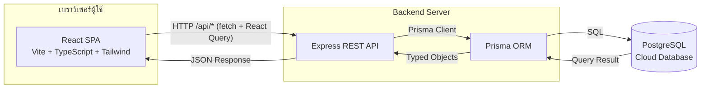
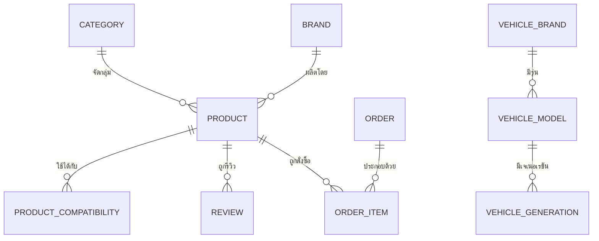
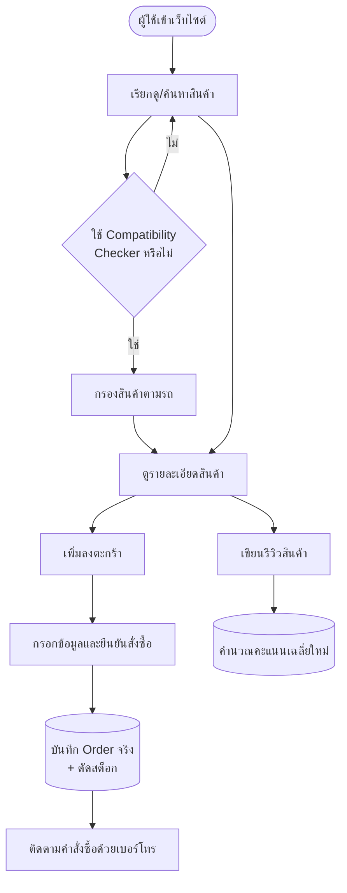

# HyperGarage — System Requirement Specification (SRS)

**เวอร์ชันเอกสาร:** 1.0
**สถานะ:** ใช้งานจริง (Production-connected demo สำหรับส่งอาจารย์)
**ผู้จัดทำ:** 65007912 นายภัทรพิสิฏ ทองเกิด

---

## 1. บทนำ (Introduction)

### 1.1 วัตถุประสงค์ (Purpose)

เอกสารฉบับนี้จัดทำขึ้นเพื่อระบุขอบเขต ความต้องการเชิงฟังก์ชัน และความต้องการที่ไม่ใช่เชิงฟังก์ชันของระบบ **HyperGarage** ซึ่งเป็นระบบพาณิชย์อิเล็กทรอนิกส์ (E-Commerce) สำหรับจำหน่ายอะไหล่แต่งเครื่องยนต์สายซิ่ง/แดร็กสไตล์ไทย ใช้เป็นเอกสารอ้างอิงสำหรับการพัฒนา ทดสอบ และตรวจรับงานของโปรเจกต์

### 1.2 ขอบเขตของระบบ (Scope)

ระบบประกอบด้วย 2 ส่วนหลักที่ทำงานร่วมกัน:

- **เว็บฝั่งลูกค้า (Storefront)** — เรียกดูสินค้า ตรวจสอบความเข้ากันได้กับรถ สั่งซื้อแบบไม่ต้องสมัครสมาชิก (Guest Checkout) เขียนรีวิว และติดตามคำสั่งซื้อด้วยเบอร์โทรศัพท์
- **เว็บฝั่งแอดมิน (Admin Panel)** — จัดการสินค้า หมวดหมู่ แบรนด์ คำสั่งซื้อ สต็อก คูปอง ข้อมูลความเข้ากันได้ของรถยนต์ และดูรายงานสรุปที่คำนวณจากข้อมูลจริงในฐานข้อมูล

ระบบ **ไม่รวม**: ระบบสมาชิก/ล็อกอิน, ระบบสิทธิ์ผู้ดูแลหลายระดับ (RBAC), การเชื่อมต่อ Payment Gateway หรือขนส่งจริง — ดูรายละเอียดในหัวข้อ [2.4 ข้อจำกัดของระบบ](#24-ข้อจำกัดของระบบ-constraints)

### 1.3 คำนิยามและคำย่อ (Definitions & Acronyms)

| คำย่อ | ความหมาย |
|---|---|
| SRS | System Requirement Specification |
| SPA | Single Page Application |
| ORM | Object-Relational Mapping |
| CRUD | Create, Read, Update, Delete |
| Guest Checkout | การสั่งซื้อโดยไม่ต้องสมัครสมาชิก |
| TDP | (ไม่เกี่ยวข้องกับระบบนี้ — ระบบไม่มีการคำนวณพลังงานฮาร์ดแวร์) |
| Compatibility Checker | ระบบตรวจสอบว่าอะไหล่ชิ้นใดใช้ได้กับรถยนต์ยี่ห้อ/รุ่น/เจเนอเรชัน/เครื่องยนต์ใดบ้าง |

### 1.4 เอกสารอ้างอิง (References)

- `server/prisma/schema.prisma` — โครงสร้างฐานข้อมูลจริงของระบบ
- `README.md` — คู่มือติดตั้งและใช้งานโปรเจกต์

---

## 2. ภาพรวมระบบ (Overall Description)

### 2.1 มุมมองผลิตภัณฑ์ (Product Perspective)

HyperGarage เป็นระบบใหม่ทั้งหมด (Greenfield) ไม่ได้พัฒนาต่อยอดจากระบบเดิม ประกอบด้วย Frontend แบบ SPA ที่คุยกับ Backend REST API ผ่าน HTTP โดย Backend ต่อกับฐานข้อมูล PostgreSQL จริงบนคลาวด์ ไม่มีข้อมูลจำลอง (mock data) หลงเหลืออยู่ในโค้ด — ทุกหน้าจอที่แสดงข้อมูลจะดึงจากฐานข้อมูลจริงเสมอ

### 2.2 ฟังก์ชันของผลิตภัณฑ์ (Product Functions)

| กลุ่มฟังก์ชัน | รายละเอียดโดยสรุป |
|---|---|
| การเรียกดูสินค้า | ค้นหา กรอง เรียงลำดับ ดูตามหมวดหมู่/แบรนด์ |
| Compatibility Checker | เลือกยี่ห้อ > รุ่น > เจเนอเรชัน > เครื่องยนต์ เพื่อกรองอะไหล่ที่ใช้ได้จริง |
| ตะกร้าและการสั่งซื้อ | เพิ่ม/ลบสินค้าในตะกร้า (เก็บใน localStorage) และ Checkout แบบ Guest |
| รีวิวสินค้า | ลูกค้าเขียนรีวิวได้จริง คะแนนเฉลี่ยคำนวณสดจากฐานข้อมูล |
| การจัดการสินค้า (Admin) | CRUD สินค้า/หมวดหมู่/แบรนด์/ข้อมูลรถยนต์ |
| การจัดการคำสั่งซื้อ (Admin) | ดูรายการ อัปเดตสถานะคำสั่งซื้อ |
| คูปองและแฟลชเซล | สร้าง/แก้ไข/ลบคูปอง กำหนดสินค้าลดราคาแบบมีเวลาจำกัด |
| แดชบอร์ดและรายงาน | สรุปยอดขาย คำสั่งซื้อ สินค้าใกล้หมด คำนวณจาก Order จริง |
| โหมดปิดปรับปรุง | สลับปิด/เปิดหน้าร้านสำหรับลูกค้าโดยไม่กระทบฝั่งแอดมิน |

### 2.3 ผู้ใช้งานระบบ (User Classes)

| ผู้ใช้ | คำอธิบาย |
|---|---|
| ลูกค้า (Guest Customer) | เข้าเว็บได้โดยไม่ต้องสมัครสมาชิก เก็บตะกร้า/รายการโปรดใน localStorage ของเบราว์เซอร์ ค้นหาคำสั่งซื้อของตนเองด้วยเบอร์โทร |
| ผู้ดูแลระบบ (Admin) | เข้าถึงหน้า `/admin/*` ได้ทั้งหมดโดยไม่มีการยืนยันตัวตน (ยังไม่มีระบบล็อกอินแอดมิน) จัดการข้อมูลสินค้า คำสั่งซื้อ และการตั้งค่าระบบ |

### 2.4 ข้อจำกัดของระบบ (Constraints)

รายการนี้เป็นขอบเขตที่ตั้งใจไม่ทำในเวอร์ชันนี้ ไม่ใช่บั๊กที่ยังไม่ได้แก้:

- ไม่มีระบบสมาชิก/ล็อกอินทั้งฝั่งลูกค้าและแอดมิน (Guest-only by design)
- หน้า `/admin/roles` เป็นหน้าอ้างอิงเท่านั้น ยังไม่มีระบบสิทธิ์แอดมินหลายระดับจริง
- ไม่มีการเชื่อมต่อ Payment Gateway หรือระบบขนส่งจริง (หน้า Payments/Shipping แสดงข้อมูลสรุปจาก Order จริง แต่ไม่ได้ต่อ API ภายนอก)
- Compatibility Checker ครอบคลุมเฉพาะรุ่นเครื่องยนต์ที่ seed ไว้ในฐานข้อมูล (เช่น Honda B16A/B18C, Toyota 4A-GE) ยังไม่ครอบคลุมทุกรุ่นที่มีอยู่จริงในตลาด
- ไม่มี automated test suite — ตรวจสอบผ่าน TypeScript type-check และทดสอบจริงผ่านเบราว์เซอร์

---

## 3. สถาปัตยกรรมระบบ (System Architecture)

ฝั่ง Frontend และ Backend เป็นโปรเจกต์ npm แยกกันคนละ `package.json` (`/` และ `/server`) พัฒนาและ build อิสระจากกัน เชื่อมกันผ่าน HTTP เท่านั้น ระหว่างพัฒนา Vite dev server จะ proxy คำขอ `/api/*` ไปยัง Express server ที่พอร์ต 4000 ให้อัตโนมัติ

---

## 4. ความต้องการเชิงฟังก์ชัน (Functional Requirements)

| รหัส | ความต้องการ | คำอธิบาย |
|---|---|---|
| FR-01 | เรียกดูรายการสินค้า | ผู้ใช้ค้นหา กรองตามหมวดหมู่/แบรนด์/ราคา และเรียงลำดับสินค้าได้ ผลลัพธ์สะท้อนใน URL query string เพื่อให้แชร์ลิงก์ได้ |
| FR-02 | ดูรายละเอียดสินค้า | แสดงสเปค รูปภาพ ราคา สต็อกคงเหลือ ตารางความเข้ากันได้กับรถ และรีวิวจริง |
| FR-03 | ตรวจสอบความเข้ากันได้ (Compatibility Checker) | เลือกยี่ห้อ > รุ่น > เจเนอเรชัน > เครื่องยนต์ เพื่อกรองเฉพาะอะไหล่ที่ตรงกับรถของผู้ใช้ |
| FR-04 | จัดการตะกร้าสินค้า | เพิ่ม/ลบ/ปรับจำนวนสินค้าในตะกร้า เก็บสถานะไว้ใน localStorage ของเบราว์เซอร์ |
| FR-05 | สั่งซื้อแบบ Guest Checkout | กรอกชื่อ/เบอร์โทร/ที่อยู่ ยืนยันคำสั่งซื้อ ระบบตัดสต็อกจริงผ่าน Prisma transaction |
| FR-06 | ติดตามคำสั่งซื้อ | ค้นหาคำสั่งซื้อของตนเองด้วยเบอร์โทรศัพท์ที่ใช้ตอนสั่งซื้อ |
| FR-07 | เขียนรีวิวสินค้า | ลูกค้าให้คะแนนดาวและเขียนความคิดเห็นได้ ระบบคำนวณคะแนนเฉลี่ยและจำนวนรีวิวใหม่จากฐานข้อมูลทันที |
| FR-08 | จัดการรายการโปรด | เพิ่ม/ลบสินค้าในรายการโปรด เก็บใน localStorage |
| FR-09 | จัดการสินค้า (Admin CRUD) | เพิ่ม/แก้ไข/ลบสินค้า ป้องกันการลบสินค้าที่มีอยู่ในคำสั่งซื้อแล้ว (Restrict) |
| FR-10 | จัดการหมวดหมู่และแบรนด์ (Admin CRUD) | เพิ่ม/แก้ไข/ลบ พร้อมกฎ Restrict แบบเดียวกับสินค้า |
| FR-11 | จัดการข้อมูลความเข้ากันได้ของรถยนต์ | เพิ่ม/ลบ ยี่ห้อ/รุ่น/เจเนอเรชัน/เครื่องยนต์ ที่ใช้ในหน้า Compatibility Checker |
| FR-12 | จัดการคำสั่งซื้อ (Admin) | ดูรายการคำสั่งซื้อทั้งหมด กรองตามสถานะ อัปเดตสถานะคำสั่งซื้อ |
| FR-13 | จัดการสต็อกสินค้า | ปรับเพิ่ม/ลดสต็อกรายสินค้า พร้อมแจ้งเตือนสินค้าใกล้หมด |
| FR-14 | จัดการคูปองและแฟลชเซล | สร้าง/แก้ไข/ลบคูปองส่วนลด และกำหนดสินค้าเข้าแฟลชเซลพร้อมเวลาสิ้นสุด |
| FR-15 | แดชบอร์ดสรุปข้อมูล | แสดงยอดขาย จำนวนคำสั่งซื้อ ยอดขายตามหมวดหมู่ และสินค้าใกล้หมด คำนวณจากข้อมูล Order จริง |
| FR-16 | โหมดปิดปรับปรุง (Maintenance Mode) | แอดมินเปิด/ปิดโหมดปิดปรับปรุงได้ ลูกค้าจะเห็นหน้าปิดปรับปรุงแทนหน้าร้านทันทีเมื่อเปิดใช้งาน โดยแอดมินยังเข้าใช้งานได้ตามปกติ |

---

## 5. ความต้องการที่ไม่ใช่เชิงฟังก์ชัน (Non-Functional Requirements)

| หมวด | ความต้องการ |
|---|---|
| การใช้งานหลายภาษา (i18n) | รองรับภาษาไทย (ค่าเริ่มต้น) และภาษาอังกฤษฝั่งลูกค้า สลับได้ทันทีโดยไม่รีเฟรชหน้า |
| ความสอดคล้องของข้อมูล | การตัดสต็อกและการคำนวณคะแนนรีวิวต้องทำผ่าน Database Transaction เพื่อป้องกันข้อมูลไม่ตรงกันเมื่อมีการสั่งซื้อ/รีวิวพร้อมกัน |
| ความปลอดภัยของข้อมูลอ้างอิง | ห้ามลบสินค้า/หมวดหมู่/แบรนด์ที่ยังถูกอ้างอิงอยู่ในคำสั่งซื้อ (Referential Restrict) |
| ความโปร่งใสของข้อมูล | ห้ามแสดงข้อมูลจำลอง (mock/fabricated data) ปะปนกับข้อมูลจริงในหน้าจอใดๆ หากไม่มีข้อมูลจริงต้องแสดงสถานะว่างที่ถูกต้อง (เช่น "ยังไม่มีรีวิว") |
| ความสามารถในการตรวจสอบ (Type Safety) | โค้ดทั้งฝั่ง Frontend และ Backend ต้องผ่าน TypeScript type-check (`tsc -b` / `tsc --noEmit`) ก่อนถือว่างานเสร็จ |
| ประสิทธิภาพ | ใช้ React Query cache ฝั่ง Frontend ลดการเรียก API ซ้ำซ้อน และ lazy-load แต่ละหน้าเพื่อลดขนาด bundle เริ่มต้น |

---

## 6. แบบจำลองข้อมูล (Data Model)

Entity หลักในฐานข้อมูล (นิยามจริงใน `server/prisma/schema.prisma`):

| Entity | คำอธิบาย | ความสัมพันธ์หลัก |
|---|---|---|
| `Category` | หมวดหมู่สินค้า | 1 หมวดหมู่ : หลายสินค้า |
| `Brand` | แบรนด์สินค้า | 1 แบรนด์ : หลายสินค้า |
| `Product` | สินค้า | อยู่ใน 1 หมวดหมู่ และ 1 แบรนด์ |
| `ProductCompatibility` | ความเข้ากันได้ของสินค้ากับรถยนต์ | หลายรายการต่อ 1 สินค้า (Cascade เมื่อลบสินค้า) |
| `VehicleBrand` / `VehicleModel` / `VehicleGeneration` | โครงสร้างข้อมูลรถยนต์สำหรับ Compatibility Checker | ลำดับชั้น ยี่ห้อ > รุ่น > เจเนอเรชัน (พร้อมรายการเครื่องยนต์) |
| `Order` / `OrderItem` | คำสั่งซื้อและรายการสินค้าในคำสั่งซื้อ | 1 คำสั่งซื้อ : หลายรายการสินค้า |
| `Review` | รีวิวสินค้า | หลายรีวิวต่อ 1 สินค้า (Cascade เมื่อลบสินค้า) |
| `Coupon` | คูปองส่วนลด | อิสระ ใช้อ้างอิงตอน Checkout |
| `StoreSettings` | การตั้งค่าร้านค้า (รวมถึง Maintenance Mode) | แถวเดียว (singleton) |

---

## 7. ลำดับการทำงานของผู้ใช้ (User Flow)

---

## 8. เทคโนโลยีที่ใช้ (Technology Stack)

| ชั้นระบบ | เทคโนโลยี |
|---|---|
| Frontend Framework | React 19 + TypeScript |
| Build Tool | Vite 6 |
| Styling | Tailwind CSS 4 |
| Routing | React Router 7 |
| Data Fetching / Cache | TanStack Query (React Query) |
| Backend | Node.js + Express |
| ORM | Prisma |
| ฐานข้อมูล | PostgreSQL |
| i18n | i18next / react-i18next |

---

## 9. ประวัติการแก้ไขเอกสาร (Revision History)

| เวอร์ชัน | วันที่ | รายละเอียดการเปลี่ยนแปลง |
|---|---|---|
| 1.0 | 2026-07-12 | จัดทำเอกสาร SRS ฉบับแรก ครอบคลุมระบบหลังจากเชื่อมต่อฐานข้อมูลจริง เพิ่มฟีเจอร์รีวิวสินค้าและโหมดปิดปรับปรุง และปรับแคตตาล็อกสินค้าเป็นอะไหล่แต่งเครื่องสายซิ่งไทย |
