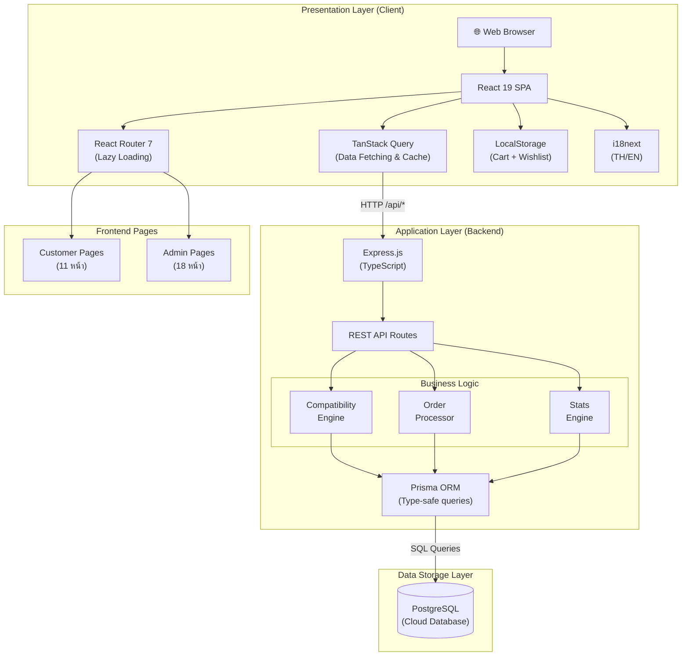
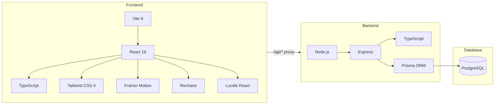
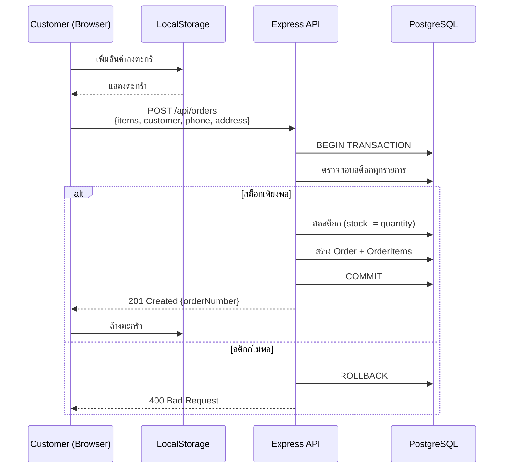
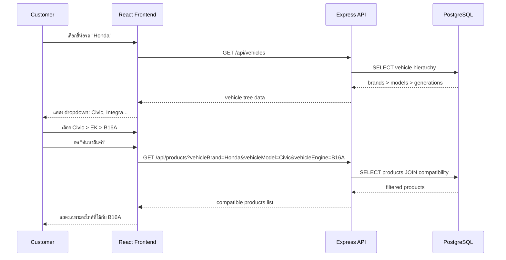

# CSI 204 Workshop 1

> **65007912 นายภัทรพิสิฏ ทองเกิด** | กลุ่ม T002

---

## System Architecture

---

## Technology Stack Overview

---

## Data Flow: Checkout Process

---

## Data Flow: Compatibility Checker

