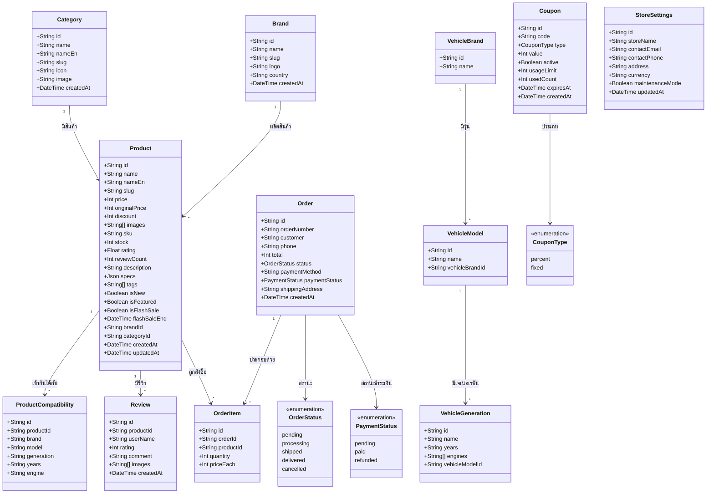

# Class Diagram

## แผนภาพคลาส ระบบ HyperGarage

---

## คำอธิบายความสัมพันธ์

| ความสัมพันธ์ | ประเภท | หมายเหตุ |
|-------------|--------|----------|
| Category → Product | One-to-Many | หมวดหมู่หนึ่งมีได้หลายสินค้า |
| Brand → Product | One-to-Many | แบรนด์หนึ่งมีได้หลายสินค้า |
| Product → ProductCompatibility | One-to-Many | สินค้าหนึ่งใช้ได้กับหลายรุ่นรถ (Cascade Delete) |
| Product → Review | One-to-Many | สินค้าหนึ่งมีได้หลายรีวิว (Cascade Delete) |
| Product → OrderItem | One-to-Many | สินค้าหนึ่งปรากฏในหลายออเดอร์ |
| Order → OrderItem | One-to-Many | ออเดอร์หนึ่งมีได้หลายรายการ (Cascade Delete) |
| VehicleBrand → VehicleModel | One-to-Many | ยี่ห้อหนึ่งมีหลายรุ่น (Cascade Delete) |
| VehicleModel → VehicleGeneration | One-to-Many | รุ่นหนึ่งมีหลายเจเนอเรชัน (Cascade Delete) |
