# CSI 204 Workshop 2

> **65007912 นายภัทรพิสิฏ ทองเกิด** | กลุ่ม T002

---

## Use Case Diagram

```mermaid
graph TB
    subgraph System["ระบบ HyperGarage"]
        UC1["ค้นหาสินค้า"]
        UC2["ตรวจสอบความเข้ากันได้<br/>(Compatibility Checker)"]
        UC3["ดูรายละเอียดสินค้า"]
        UC4["จัดการตะกร้าสินค้า"]
        UC5["สั่งซื้อสินค้า<br/>(Guest Checkout)"]
        UC6["ติดตามคำสั่งซื้อ"]
        UC7["เขียนรีวิวสินค้า"]
        UC8["จัดการรายการโปรด"]
        UC9["ดูโปรโมชั่น/คูปอง"]
        
        UC10["จัดการสินค้า (CRUD)"]
        UC11["จัดการหมวดหมู่"]
        UC12["จัดการแบรนด์"]
        UC13["จัดการข้อมูลรถยนต์"]
        UC14["จัดการคำสั่งซื้อ"]
        UC15["จัดการคูปอง/Flash Sale"]
        UC16["ดู Dashboard/รายงาน"]
        UC17["จัดการสต็อกสินค้า"]
        UC18["ตั้งค่าระบบ"]
        UC19["เปิด/ปิด Maintenance Mode"]
    end

    Customer(("👤 ลูกค้า<br/>(Customer)"))
    Admin(("👤 ผู้ดูแลระบบ<br/>(Admin)"))

    Customer --> UC1
    Customer --> UC2
    Customer --> UC3
    Customer --> UC4
    Customer --> UC5
    Customer --> UC6
    Customer --> UC7
    Customer --> UC8
    Customer --> UC9

    Admin --> UC10
    Admin --> UC11
    Admin --> UC12
    Admin --> UC13
    Admin --> UC14
    Admin --> UC15
    Admin --> UC16
    Admin --> UC17
    Admin --> UC18
    Admin --> UC19

    UC5 -.->|"include"| UC4
    UC2 -.->|"include"| UC1
```

---

## รายละเอียด Use Case หลัก

### UC-01: ค้นหาสินค้า
- **Actor**: ลูกค้า
- **Precondition**: -
- **Main Flow**: ลูกค้าพิมพ์คำค้นหา หรือเลือกกรองตามหมวดหมู่/แบรนด์/ราคา ระบบแสดงรายการสินค้าที่ตรงเงื่อนไข
- **Postcondition**: แสดงผลลัพธ์พร้อม sort/filter

### UC-02: ตรวจสอบความเข้ากันได้ (Compatibility Checker)
- **Actor**: ลูกค้า
- **Precondition**: -
- **Main Flow**: ลูกค้าเลือกยี่ห้อรถ > รุ่น > เจเนอเรชัน > เครื่องยนต์ ระบบกรองแสดงเฉพาะอะไหล่ที่เข้ากันได้
- **Postcondition**: แสดงเฉพาะสินค้าที่ compatibility match
- **Include**: UC-01 (ค้นหาสินค้า)

### UC-05: สั่งซื้อสินค้า (Guest Checkout)
- **Actor**: ลูกค้า
- **Precondition**: มีสินค้าในตะกร้า, สินค้ามีสต็อกเพียงพอ
- **Main Flow**: ลูกค้ากรอกชื่อ เบอร์โทร ที่อยู่ เลือกช่องทางชำระเงิน กดยืนยัน ระบบตัดสต็อก สร้างออเดอร์
- **Postcondition**: สร้าง Order สำเร็จ สต็อกลดลง แสดงหมายเลขคำสั่งซื้อ
- **Exception**: สต็อกไม่พอ → แสดง error

### UC-10: จัดการสินค้า (CRUD)
- **Actor**: ผู้ดูแลระบบ
- **Precondition**: เข้าหน้า /admin/products
- **Main Flow**: เพิ่ม/แก้ไข/ลบสินค้า กำหนดราคา สต็อก สเปค รูปภาพ ความเข้ากันได้กับรถ
- **Postcondition**: ข้อมูลอัปเดตในฐานข้อมูล
- **Exception**: ลบสินค้าที่มีออเดอร์ → 409 Conflict
